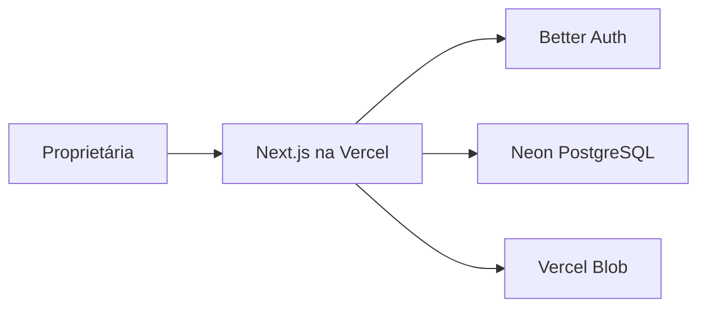

# Arquitetura do sistema

## Visão geral

A aplicação usa Next.js como frontend e backend. O navegador nunca recebe a credencial do banco. Server Components, Server Actions e Route Handlers acessam o PostgreSQL do Neon pelo servidor da aplicação.



## Organização

```text
src/
  app/                 rotas, layouts e composição de telas
    (dashboard)/       área autenticada da operação
  components/          componentes compartilhados de interface
  config/              navegação e configurações estáticas
  db/
    schema/             tabelas separadas por domínio
    index.ts            conexão server-only com o Neon
  features/             regras e casos de uso por domínio
  lib/                  utilitários transversais
docs/                   arquitetura, decisões e planejamento
drizzle/                migrations SQL versionadas
```

Uma feature deverá manter sua regra de negócio perto do domínio correspondente:

```text
features/sales/
  actions/              entradas chamadas pelas telas
  domain/               regras puras e testáveis
  queries/              consultas de leitura
  repositories/         persistência do domínio
  schemas/              validação das entradas
```

Essas subpastas serão criadas quando houver implementação real, evitando arquivos vazios.

## Limites dos domínios

| Domínio | Responsabilidade |
| --- | --- |
| Catálogo | Produtos, categorias, tipos, fornecedores e variações |
| Estoque | Saldo atual, entradas, ajustes e histórico de movimentos |
| Vendas | Venda, itens, descontos, origens e pagamentos mistos |
| Caixa | Sessão diária, entradas, saídas, conferência e fechamento |
| Clientes | Cadastro e histórico consolidado |
| Fiado | Contas a receber, vencimento e pagamentos parciais |
| Trocas | Itens devolvidos/entregues, prazo, diferença e estoque |
| Relatórios | Consultas agregadas sem alterar dados operacionais |

## Autenticação

- Better Auth é executado no servidor Next.js e persiste usuários, contas e sessões no próprio PostgreSQL do Neon.
- Todas as páginas operacionais possuem proteção no `proxy.ts` e validação novamente no layout do servidor.
- O primeiro cadastro depende de `AUTH_ALLOW_SIGN_UP=true` e o banco impede a criação normal de uma segunda proprietária.
- Senhas são armazenadas como hashes pelo provedor de autenticação; a aplicação nunca guarda senha em texto.
- A migração inclui as tabelas `user`, `session`, `account` e `verification`.

## Consistência transacional

Operações compostas devem acontecer integralmente no PostgreSQL:

- confirmar venda, baixar estoque e registrar pagamentos;
- cancelar venda, estornar estoque e caixa;
- confirmar entrada e aumentar estoque;
- receber fiado, reduzir saldo e registrar movimento de caixa;
- concluir troca e movimentar todos os itens envolvidos.

Se qualquer etapa falhar, toda a operação deverá ser revertida.

## Dados e auditoria

- Valores financeiros usam `numeric(12,2)`.
- Datas operacionais usam timestamp com fuso; datas de vencimento usam `date`.
- Produtos, vendas, pagamentos e movimentos não serão apagados fisicamente pela interface.
- O saldo fica na variação para leitura rápida, mas toda mudança gera `stock_movements`.
- Pagamentos de fiado possuem chave de idempotência para evitar duplicidade.
- Itens de venda guardam o nome e a variação da época da venda como snapshot.

## Ambientes

- Desenvolvimento: `.env.local` e um branch/banco de desenvolvimento.
- Preview: deploy da Vercel conectado a branch isolada quando disponível.
- Produção: banco principal protegido e migrations aplicadas pelo processo de entrega.

O plano Hobby da Vercel deve ser usado apenas para desenvolvimento e demonstração; a operação comercial deverá utilizar hospedagem compatível com uso comercial.
